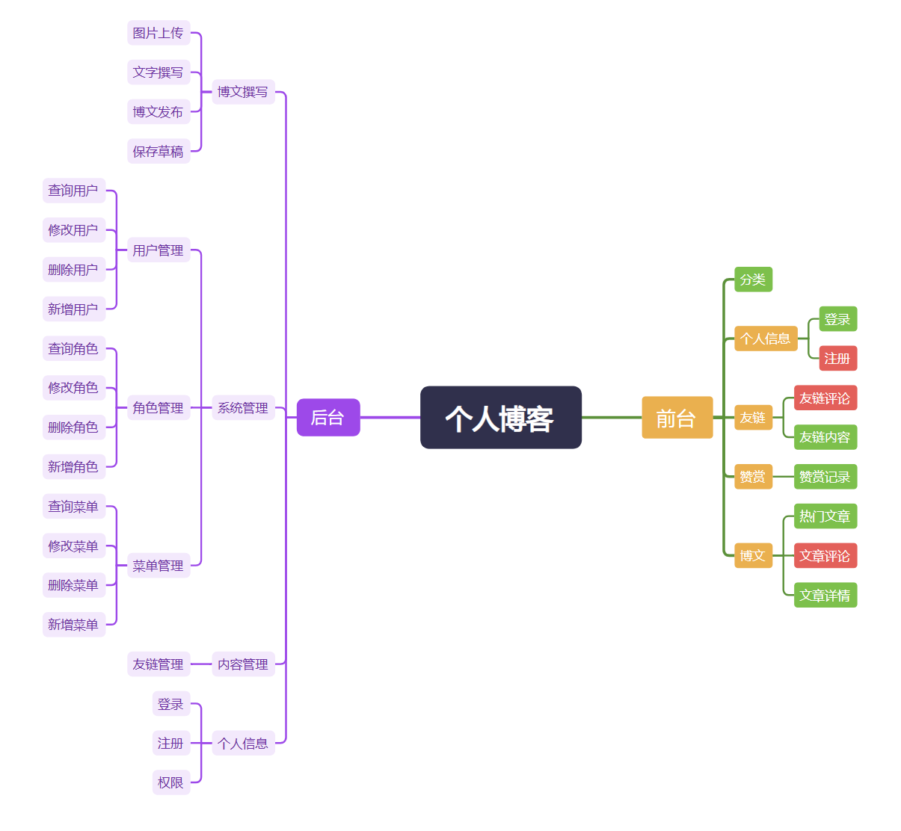
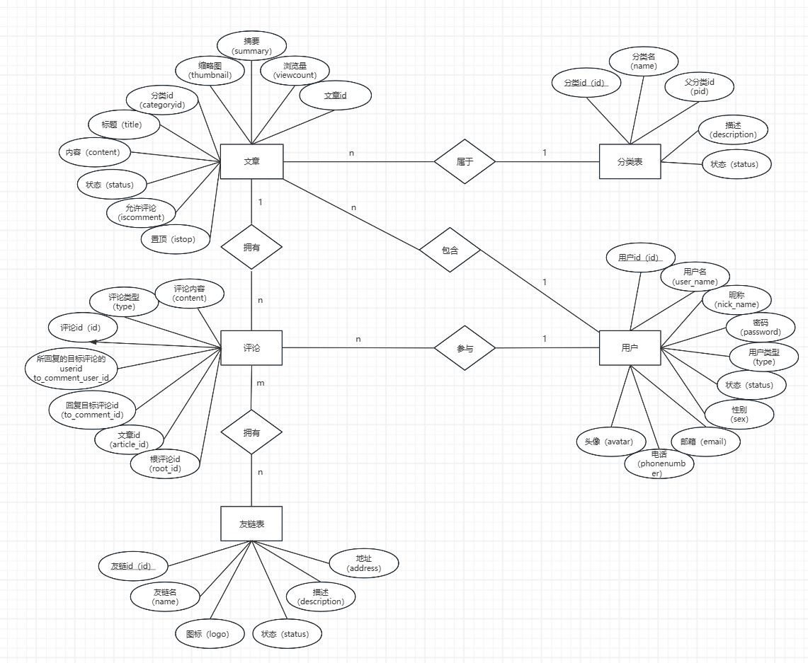
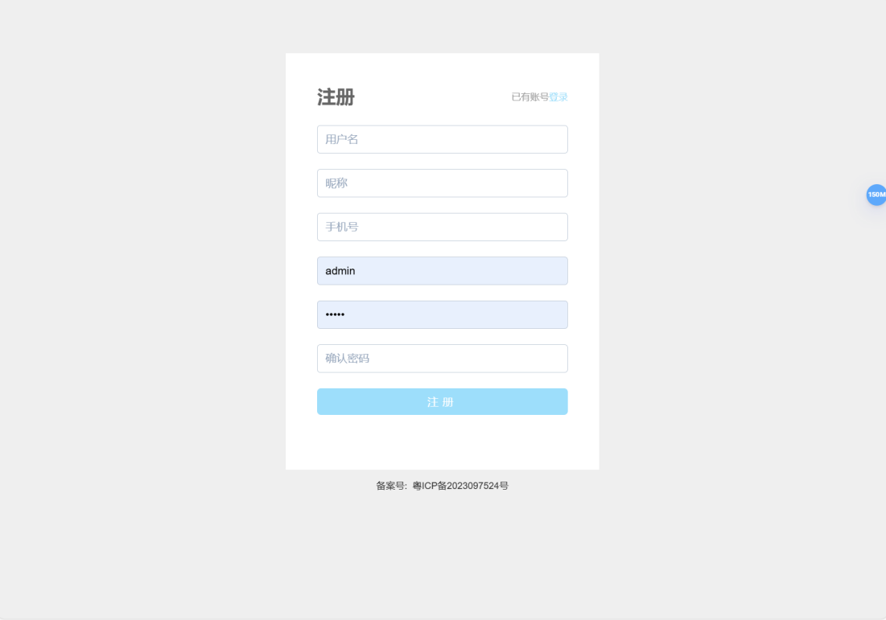
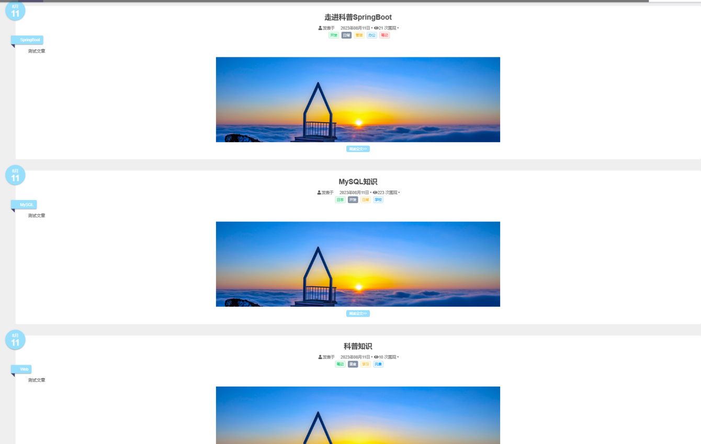
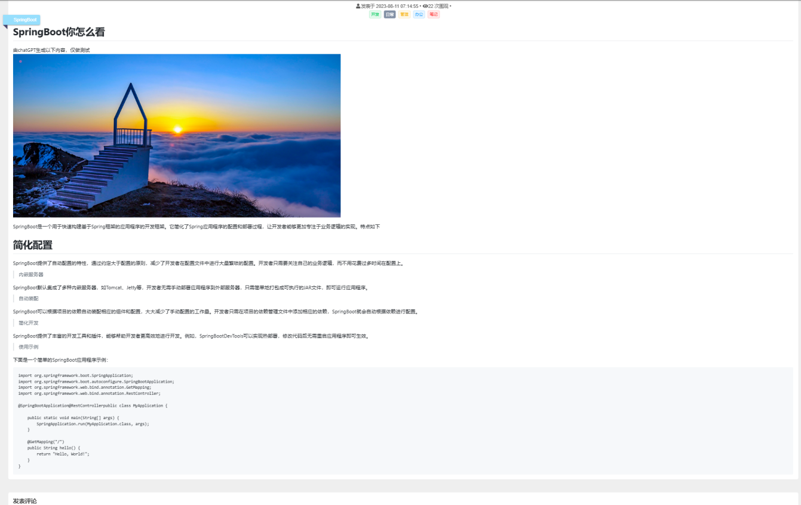
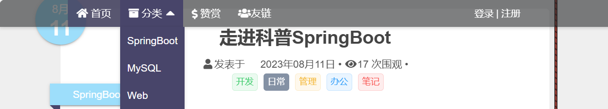
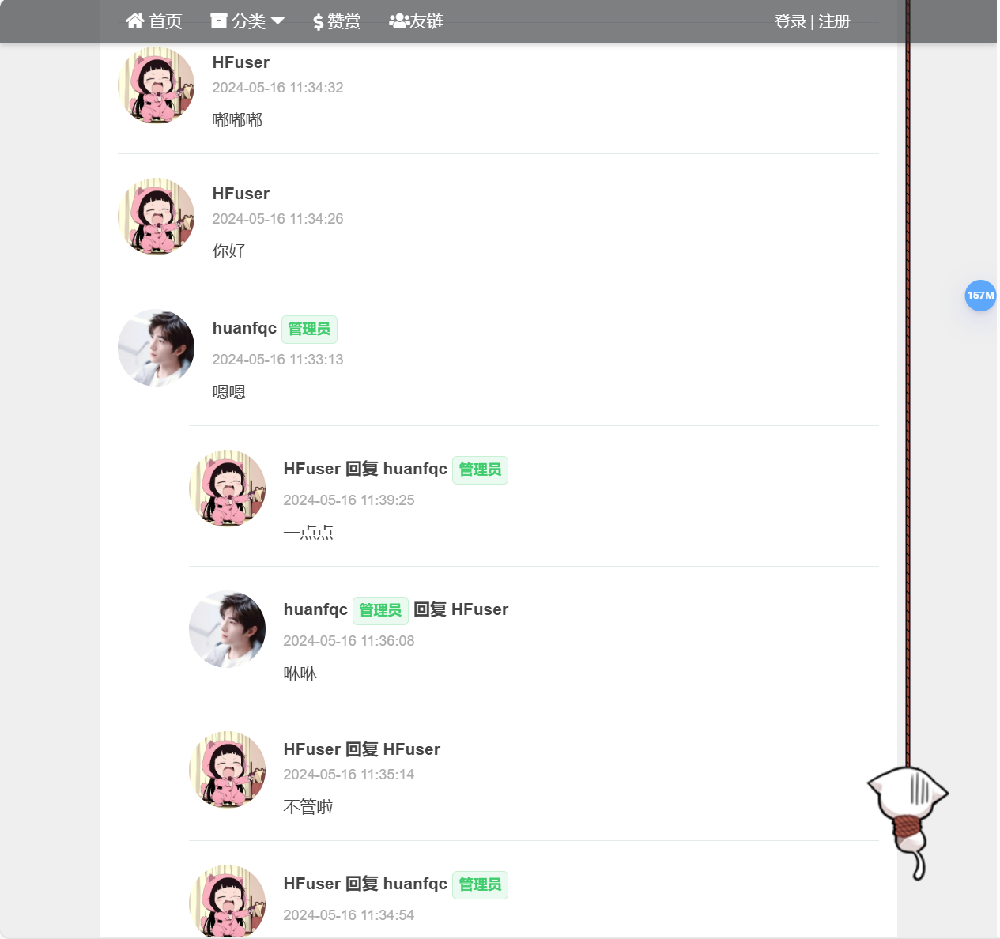
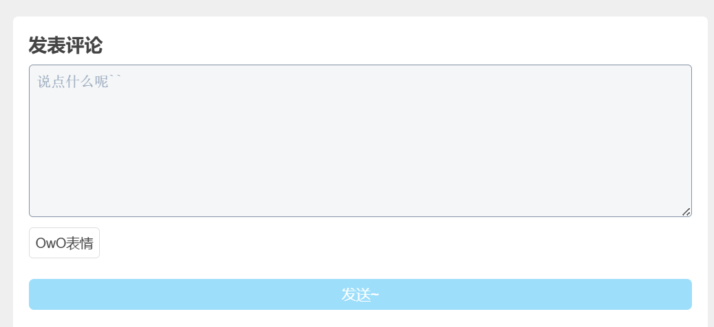
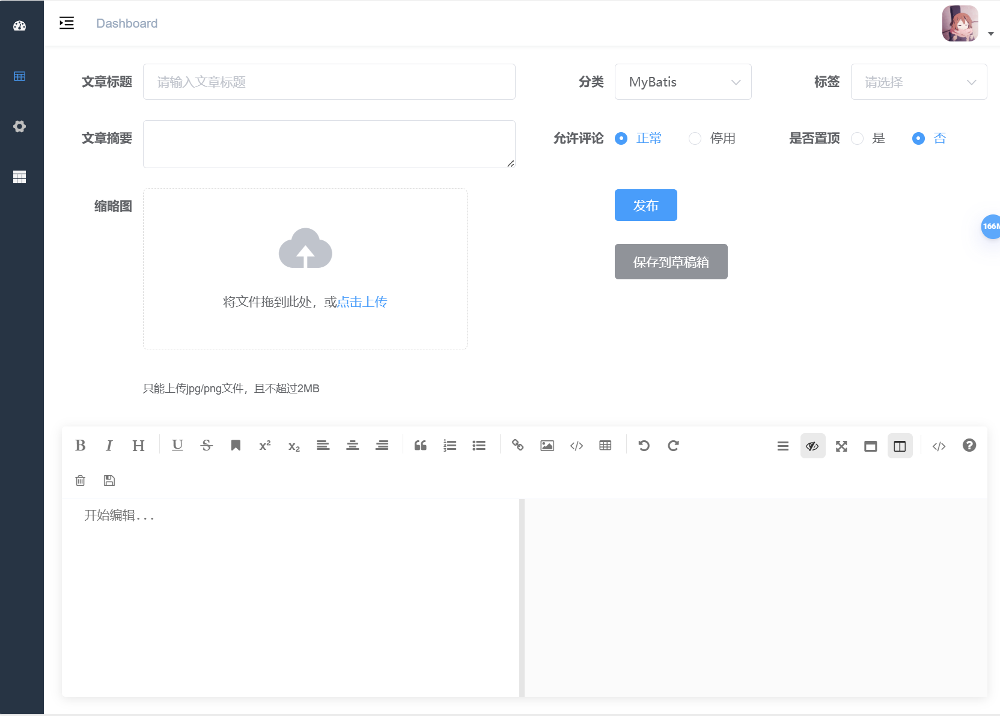
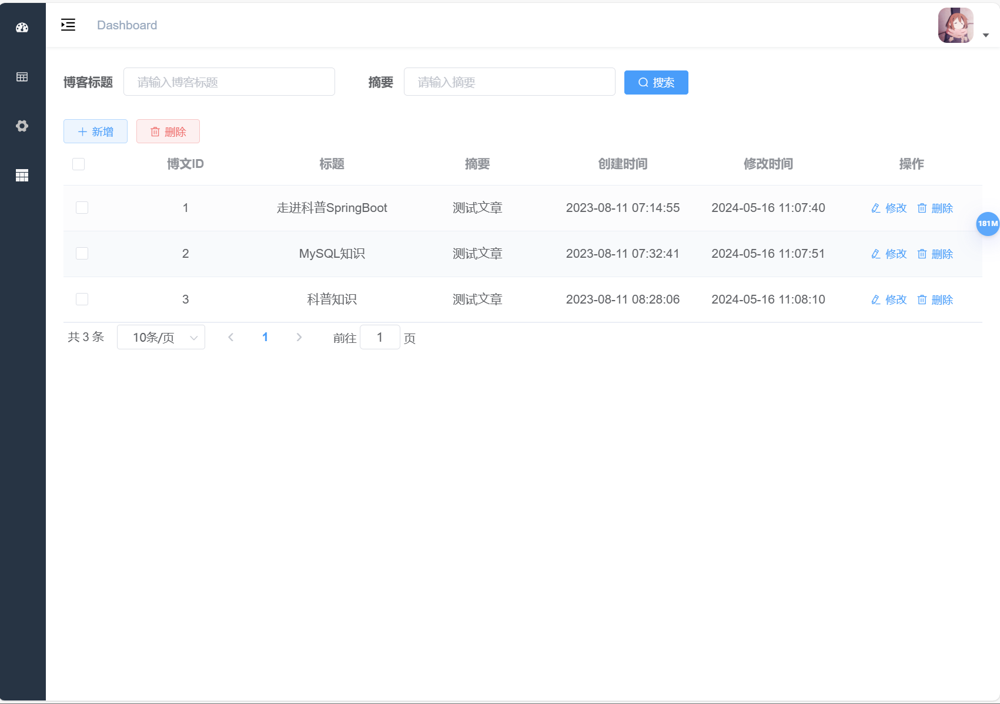

本文设计并实现了一个基于SpringBoot与Vue的个人博客系统，核心功能包括用户注册登录、博文撰写与分类管理、热门文章推荐、嵌套式评论互动及友链审核展示。后端采用SpringBoot框架集成MyBatis-Plus简化数据库操作，通过Redis缓存优化访问性能，并基于JWT+Spring Security实现RBAC权限控制；前端使用Vue.js构建单页面应用，结合Markdown编辑器提升内容创作体验。系统引入统一响应格式，兼顾安全性、可维护性与扩展性。该实践验证了SpringBoot+Vue技术栈在个人博客开发中的高效性与实用性，为内容管理系统的设计与优化提供了参考。
>本系统功能设计结构图
>---

>数据库设计
>---

>注册功能
>---

>查看文章列表功能
>---

>查看文章详情功能
>---

>文章分类
>---

>评论区
>---

>发布评论
>---

>博文撰写功能
>---

>博客管理
>---

